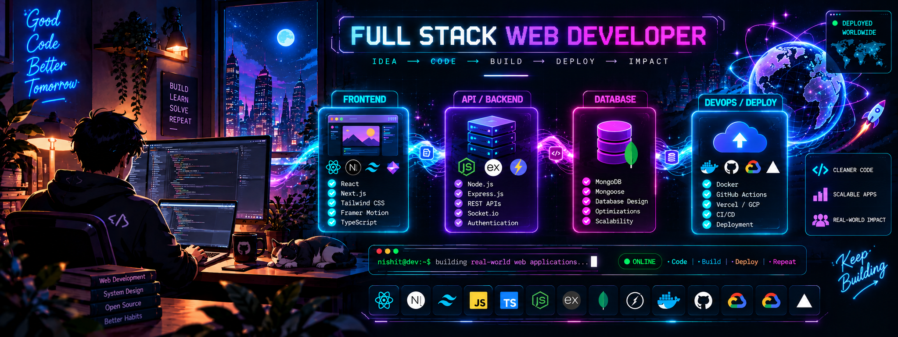

### <h1 align="center">Hi 👋, I'm Nishit Khatri </h1>

# 💫 About Me:
- 🌱  I’m currently learning **Cloud Computing**

- 💬  Ask me about **MERN**

- 👨‍💻  All of my projects are available at **[My Portfolio](https://nishit-khatri-portfolio.vercel.app/)**

- 📫  How to reach me **nishitkhatri.dev@gmail.com**

- 📄   Know about my experiences **[My Resume](https://drive.google.com/file/d/1lOnjVA4YfueVZB7Sxu1W6RmP8WjFTduw/view?usp=drive_link)**

## 🌐 Socials:
  

# 💻 Tech Stack:
                           
# 📊 GitHub Stats:
 
 

### ✍️ Random Dev Quote

---

